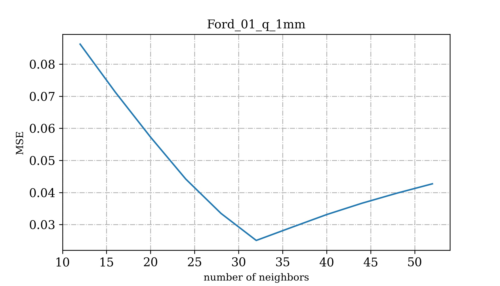
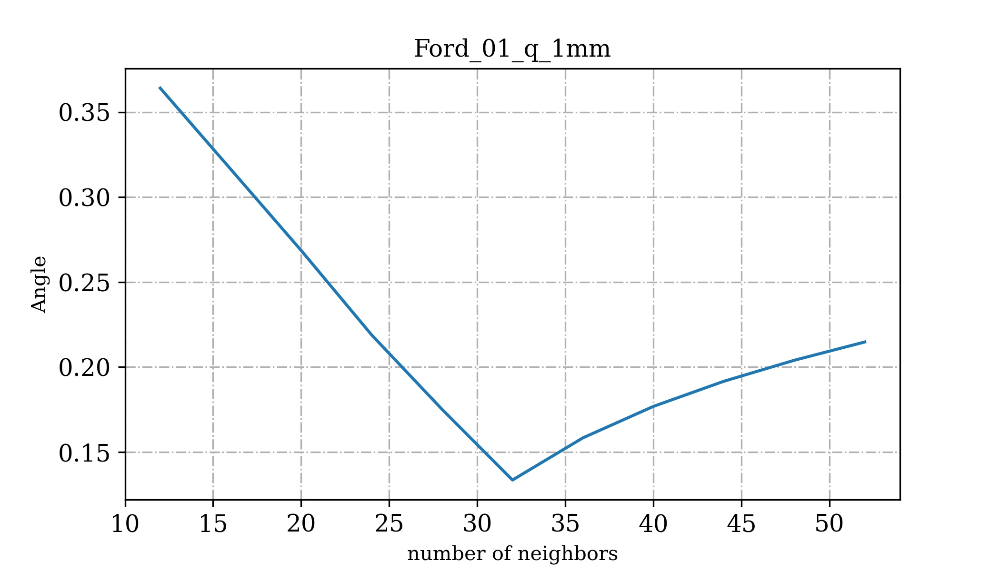
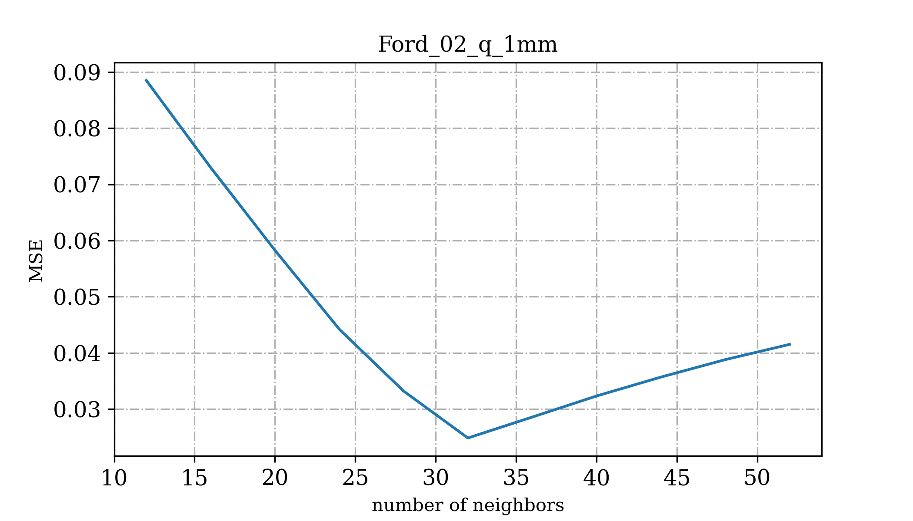
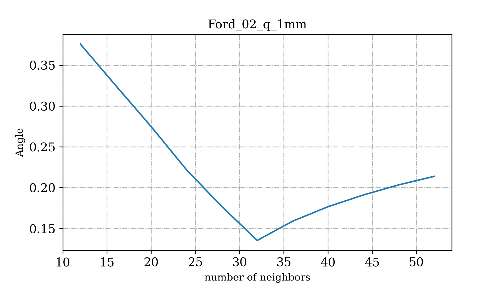
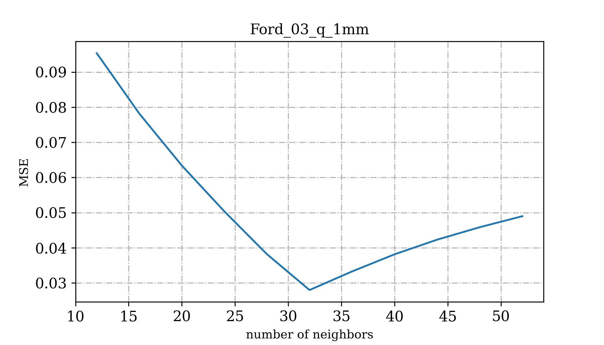
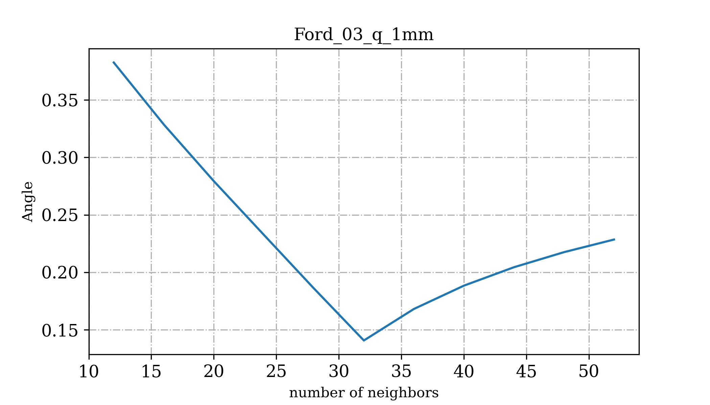

# Normal Calculation Experiments


## Goal
The goal here is to use estimate normals with different parameters on FORD LiDAR dataset and compare them with the original normals within the Ford dataset. \
I used the following library for point cloud estimations:\
https://github.com/fwilliams/point-cloud-utils#estimating-normals-from-a-point-cloud

The goal was to estimate point cloud normals using the following functions:
```
import point_cloud_utils as pcu

# Estimate a normal at each point (row of v) using its 16 nearest neighbors
n = pcu.estimate_point_cloud_normals_knn(v, 16)

# Estimate a normal at each point (row of v) using its neighbors within a 0.1-radius ball
n = pcu.estimate_point_cloud_normals_ball(v, 0.1)
```

### Evaluation Metrics
I employed the MSE between the normals as well as the angle between the normals as my evaluation metric.

## Issues
### Issue 1: Wrong normals
When I use too few number of neighbors, e.g. 12 neighbors for normal estimation, I see a lot of normals calculated as `[0, 0, 1]`.
I am assuming this is incorrect normal estimation.

### Issue 2: Direction of normals not the same
When I compare the estimated normals to the normals in the groundtruth files, I see that the direction of normals are often not the same. 
For some point, the direction of normal is the same. However, for a lot of points the direction of normals is the opposite.

To solve this, I calculated the difference in normals for both directions and then chose the minimum of those values. E.g.:

```
sklearn.metrics.mean_squared_error(n, n1)
>>> 0.433772502187794
((n-n1)**2).mean()
>>> 0.433772502187794

sklearn.metrics.mean_squared_error(n, -n1)
>>> 0.89956083005143
((n+n1)**2).mean()
>>> 0.89956083005143

# My implementation
mean1 = ((n-n1)**2).mean(1)
mean2 = ((n+n1)**2).mean(1)
row_wise_mean = np.array(list(map(min, zip(mean1, mean2))))
mse3 = row_wise_mean.mean()
mse3
>>> 0.030754027161201146
```

### Issue 3: Normal estimation using ball discards points

```
n = pcu.estimate_point_cloud_normals_ball(v, 0.1)
```
Normals obtained from the following function discards points. Going into the function implementation, I see this mentioned:
```
def estimate_point_cloud_normals_ball(points, ball_radius, view_directions=None,
                                      drop_angle_threshold=np.deg2rad(90.0),
                                      min_pts_per_ball=3,
                                      weight_function="rbf",
                                      max_points_per_leaf=10, num_threads=-1):
									  
	"""
	min_pts_per_ball: Discard points whose neighborhood contains fewer than min_pts_per_ball points.
	"""
```

parameter `min_pts_per_ball` cannot be set to less than 3. I am currently unable to use this function.


## Results

### Sequence 1
#### MSE Plot
<center><p>
    
</p></center>

#### Angle Plot
<center><p>
    
</p></center>

### Sequence 2
#### MSE Plot
<center><p>
    
</p></center>

#### Angle Plot
<center><p>
    
</p></center>


### Sequence 3
#### MSE Plot
<center><p>
    
</p></center>

#### Angle Plot
<center><p>
    
</p></center>


## Conclusion
It seems using number of neighboring points as 32 while estimating the normals produce the results closest to the Ford Dataset ground truth. Using number of neighboring points less than 20 is not a good idea.

